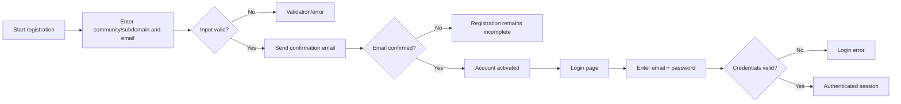

# Yooco — Functional and Technical Research

**Research date:** 14 August 2026  
**Primary product:** https://www.yooco.de  
**Scope:** Publicly verifiable functionality, authentication, roles and permissions, limits, architecture/technology
indicators, integrations, security/privacy, deployment, pricing, and developer resources.

> **Evidence note:** This document is a faithful English translation and consolidation of the research findings. Where
> the original research relied on inference rather than explicit Yooco documentation, that is marked as an assumption or
> lower-confidence conclusion. No private/internal Yooco implementation details were available.

---

## Executive Summary

Yooco (www.yooco.de) is a German white-label online platform for creating custom social-network communities. Public
company/profile information describes functionality including community layout management, forums, chats, events, blogs,
member management, and an integrated “gift shop.” The platform offers a free base plan plus paid plans with
progressively larger resource quotas and additional features.

The publicly observable product model is that of a **multi-tenant hosted SaaS**: each community is available under its
own Yooco subdomain (for example, `community-name.yooco.de`) or, depending on the plan, an external/custom domain. Each
community has its own members, content, settings, and administrative area.

The public evidence supports a **traditional web application architecture** using HTML/CSS/JavaScript on the client and
a server-side application stack. Cloudflare appears in the delivery path, and Yooco's privacy documentation explicitly
references TLS/SSL, cookies, Google Analytics, and Google reCAPTCHA. The exact application framework, programming
language/version, database engine, internal service topology, and deployment architecture are not officially documented.

The authentication experience appears to be based primarily on **email address + password**, with a “keep me logged in”
option. The public research found no evidence of documented social login (OAuth/OIDC) or two-factor authentication.
Email verification is part of registration, and Yooco publishes a support article explaining why verification emails may
not arrive.

The permission model is notable because Yooco documents **fine-grained per-user permissions**. Administrators can open a
member profile, select “Permissions,” and grant individual capabilities such as editing, deleting, or locking forum
posts. The platform also has **user groups**, but the public help material indicates that these groups primarily provide
a title/icon/label rather than acting as a conventional role-based access-control (RBAC) mechanism. Administrative
rights are therefore more directly represented by explicit permissions than by a conventional hierarchy of named roles.

The product contains a broad set of social-community features: profiles, members, photos/videos, private messages,
forums, chat, events/calendar, groups, blogs, downloads, image voting, flirt functionality, and a virtual gift shop.
Feature availability varies by plan.

The strongest limitations visible from public materials are **storage quotas**, plan-dependent feature availability,
domain limitations, advertising in lower-cost plans, and limited public developer extensibility. No public REST/GraphQL
API, SDK, webhook documentation, or formal integration platform was found.

---

## 1. Product Model and Multi-Tenancy

Yooco is positioned as a service for creating an independent social network/community with the operator's own design and
members.

Typical tenant structure:

```text
Yooco platform
└── Community / tenant
    ├── Community domain/subdomain
    ├── Community settings
    ├── Members
    ├── Profiles
    ├── Forums
    ├── Chat
    ├── Media
    ├── Pages/content
    ├── Events
    └── Administration
```

### Community URL model

Public examples demonstrate Yooco-hosted community domains such as:

```text
https://<community>.yooco.de/
```

The exact URL routing differs by feature/page, with examples such as `/home.html` and `/forum/index.html` visible in
public pages.

### Community privacy model

Yooco supports **private communities**. The official help page states that in a private community, only members who have
received an invitation can register.

**Evidence level:** High — explicitly documented by Yooco.

Source:  
https://www.yooco.de/faq/i/9/wie_erstelle_ich_eine_private_community.html

---

# 2. Registration and Authentication

## 2.1 Community-owner registration

The community creation flow is initiated from Yooco's public site.

The publicly visible flow includes:

1. Choose the desired Yooco community/subdomain.
2. Enter an email address.
3. Accept the relevant terms/privacy requirements.
4. Submit the registration.
5. Receive an email confirmation/verification message.
6. Complete activation through the verification flow.
7. Log in to administer the newly created community.

The homepage exposes the community-creation fields and an email address field.

Source:  
https://www.yooco.de/

**Evidence level:** High for the visible fields and creation concept; medium for the complete end-to-end workflow
because some post-submission UI states are not publicly documented.

---

## 2.2 Member registration

Individual communities expose their own login/registration experience. Publicly accessible example communities show a
login prompt and a “sign up” entry point.

The research found evidence of:

- email-based authentication
- password-based authentication
- explicit registration/sign-up
- community-level registration restrictions
- invitation-only registration for private communities

**Evidence level:** High.

Example public community:  
http://linin.yooco.de/home.html

---

## 2.3 Email verification

Yooco's help documentation explicitly addresses missing confirmation emails and notes that they may fail to arrive for
reasons such as:

- spam filtering
- incorrect email address
- a full mailbox
- other mail-delivery problems

This strongly indicates that **email verification is part of the registration lifecycle**.

Source:  
https://www.yooco.de/faq/i/62/warum_kommen_manche_bestaetigungsmails_nicht_an.html

**Evidence level:** High.

---

## 2.4 Login

The publicly observed login form contains:

- email address
- password
- login action
- a “keep me logged in” / persistent-login option

Public pages expose the login form and related input fields.

Sources:  
https://www.yooco.de/forum/index.html  
http://linin.yooco.de/home.html

**Evidence level:** High.

### Likely session behavior

The “keep me logged in” option strongly suggests persistent session state using cookies or another browser-side session
mechanism. Yooco's privacy documentation explicitly references cookies and session-related processing.

However, the following details are **not publicly documented**:

- exact cookie names
- exact session lifetime
- refresh-token architecture
- idle timeout
- absolute session timeout
- token rotation
- whether a persistent login uses a long-lived signed token, server-side session, or another mechanism

**Evidence level:** Medium for cookie-based sessions; low for the exact implementation.

---

## 2.5 Password reset

The public research indicates a conventional password-recovery flow in which the user requests password recovery and
receives an email-based reset/recovery mechanism.

**Evidence level:** Medium.

The exact implementation details are not publicly documented, including:

- whether a reset token is single-use
- token lifetime
- whether password history is enforced
- password complexity requirements
- account enumeration protections

---

## 2.6 Social login and 2FA

The research found **no public evidence** of:

- Google Sign-In
- Facebook Login
- Apple Sign-In
- generic OAuth/OIDC login
- SAML SSO
- two-factor authentication (2FA/MFA)

This should **not** be interpreted as proof that these mechanisms do not exist internally; rather, they were not found
in the public documentation and visible product material reviewed.

**Evidence level:** Low-to-medium negative evidence.

---

## 2.7 Authentication flow

A conservative reconstruction of the publicly observable flow is:



The diagram deliberately avoids asserting undocumented implementation details such as database transactions or token
formats.

---

# 3. Roles, Permissions, and Access Control

## 3.1 Administrator / founder

The creator of a Yooco community is the **founder account** and has the highest level of administrative authority.

Public documentation indicates that the founder can:

- manage the community
- change community settings
- manage other members
- configure permissions
- administer features
- configure design/content
- assign administrative rights
- delete the community

The AGB/Terms explicitly identify the founder account as the account with authority to delete the community.

Sources:  
https://www.yooco.de/agb.html  
https://www.yooco.de/faq/c/2/community_verwalten.html

**Evidence level:** High.

---

## 3.2 Per-user permissions

One of the most important findings is that Yooco supports **individual, per-user permissions**.

The official help article instructs the administrator to:

1. Open the user's profile.
2. Select “Permissions.”
3. Configure individual capabilities.
4. Examples include deciding whether that user may edit, delete, or lock forum posts.

Source:  
https://www.yooco.de/faq/i/22/wie_vergebe_ich_benutzer_adminrechte.html

**Evidence level:** High.

This implies that Yooco's practical authorization model is more granular than a simple “admin vs. member” split.

### Conceptual model

```text
Member
  └── Explicit permission flags
      ├── moderation permission A
      ├── moderation permission B
      ├── content permission C
      └── administration permission D
```

The exact complete permission matrix is not publicly enumerated in the research material.

---

## 3.3 User groups

Yooco also provides **user groups**.

The help material describes them as a way to assign a title or icon to users, managed from:

`Administration area → Members → User groups`

This makes them function more like **visible member labels / badges** than a conventional role definition.

Source:  
https://www.yooco.de/faq/i/39/wie_kann_ich_anderen_mitgliedern_meiner_community_einen_status_wie_ich_ihn_als_admin_habe_der_dann_im_betreffenden_profil_angezeigt_wird_geht_das_ueberhaupt_ohne_zusatzpaket.html

**Evidence level:** High.

### Important distinction

A user group such as “Moderator” does **not necessarily grant moderation rights by itself**.

Instead:

- **User group** = identity/label/presentation
- **Permission assignment** = actual access-control capability

This separation is important when modeling a replacement system.

---

## 3.4 Likely role model

Based on public documentation, the minimum safe conceptual model is:

| Role / concept          | Meaning               | Access characteristics                     |
|-------------------------|-----------------------|--------------------------------------------|
| Founder / Administrator | Community owner       | Broad administrative access                |
| Member                  | Normal community user | Standard social/community functionality    |
| User group              | Custom label/badge    | Primarily presentation/identification      |
| Individual permission   | Explicit capability   | Fine-grained control over specific actions |

**Evidence level:** High for the existence of these concepts; the exact internal database representation is unknown.

---

# 4. Core Functional Areas

## 4.1 Member profiles

Public product material supports a social-network model with:

- member accounts
- profiles
- member management
- profile-based interaction

The platform is explicitly marketed around its own members and profiles.

Source:  
https://www.yooco.de/

**Evidence level:** High.

---

## 4.2 Private messaging

Yooco explicitly lists **private messages** as a core feature.

Source:  
https://www.yooco.de/

**Evidence level:** High.

---

## 4.3 Forums / discussion boards

Forums are a central component.

Public material and help documentation indicate:

- forums
- multiple subforums
- forum posting
- moderation
- editing/deleting/locking of forum posts
- administrator-configurable permissions

Source:  
https://www.yooco.de/faq/i/22/wie_vergebe_ich_benutzer_adminrechte.html

**Evidence level:** High.

---

## 4.4 Chat

Yooco explicitly advertises a chat function.

Depending on the plan, the platform distinguishes additional/group-oriented functionality.

The research found references to:

- public chat
- private chat/messages
- group chat

**Evidence level:** High for the overall chat functionality; medium for the exact feature matrix per plan.

---

## 4.5 Photos and videos

The public product pages list:

- pictures
- videos
- galleries
- media uploads

Source:  
https://www.yooco.org/

**Evidence level:** High.

---

## 4.6 Events and calendar

Yooco supports:

- events
- calendar management
- event participation/attendee handling

External product descriptions corroborate this.

Source:  
https://tracxn.com/d/companies/yooco/__dtfi7mHQCEcy_wvWEas_Ytf8de4a6o4qmwDXGkw1zdk

**Evidence level:** High for the feature category; medium for detailed workflow semantics.

---

## 4.7 Blogs

The pricing comparison explicitly lists **Blogs**.

Source:  
https://www.yooco.de/plans-compare.html

**Evidence level:** High.

---

## 4.8 Groups

The plan-comparison page explicitly lists a **Groups** feature.

Source:  
https://www.yooco.de/plans-compare.html

**Evidence level:** High.

---

## 4.9 Download portal

The plan-comparison page explicitly lists a **Download Portal**.

Source:  
https://www.yooco.de/plans-compare.html

**Evidence level:** High.

---

## 4.10 Virtual gift shop

The platform includes a **gift shop** concept, described as an integrated gift-shop feature.

External company/product descriptions corroborate this.

Source:  
https://tracxn.com/d/companies/yooco/__dtfi7mHQCEcy_wvWEas_Ytf8de4a6o4qmwDXGkw1zdk

**Evidence level:** High for existence; low for internal transaction architecture.

---

## 4.11 Image voting

The plan comparison references **Top/Flop image voting**.

Source:  
https://www.yooco.de/plans-compare.html

**Evidence level:** High.

---

## 4.12 Flirt functionality

The plan comparison references a **Flirt** feature.

Source:  
https://www.yooco.de/plans-compare.html

**Evidence level:** High for feature existence.

---

# 5. Design, Branding, and Website/CMS Capabilities

Yooco is not only a social network backend; it is also a **community site builder / hosted CMS-like system**.

Public help documentation covers:

- design configuration
- CSS customization
- page/content configuration
- terms/legal pages
- layout customization

The help center includes a specific section for **Design / CSS**, including guidance on entering custom CSS.

Source:  
https://www.yooco.de/faq/c/3/design__css.html

**Evidence level:** High.

---

## 5.1 Custom content

The plan-comparison material references:

- “own content on all pages”
- design/layout customization
- white-label capabilities

Source:  
https://www.yooco.de/plans-compare.html

**Evidence level:** High.

---

## 5.2 White-label

A **White-Label package** is explicitly listed in the pricing comparison.

This indicates that the higher-tier product can remove or reduce Yooco branding and make the community appear more like
an independently branded service.

Source:  
https://www.yooco.de/plans-compare.html

**Evidence level:** High.

---

## 5.3 CSS customization

The public support center explicitly documents custom CSS.

This suggests that operators can customize presentation without having access to the core application source code.

Source:  
https://www.yooco.de/faq/c/3/design__css.html

**Evidence level:** High.

---

# 6. Storage and Resource Limits

The research identified plan-specific storage quotas:

| Plan    | Storage |
|---------|--------:|
| Free    |    2 GB |
| Start   |    5 GB |
| Premium |   10 GB |
| Profi   |   25 GB |

Source:  
https://www.yooco.de/plans.html

**Evidence level:** High, based on the public plan table examined.

### Members

The public plans indicate **unlimited members** across the available packages.

Source:  
https://www.yooco.de/plans.html

**Evidence level:** High.

### Other resource limits

The research did **not** find reliable public documentation for exact:

- maximum upload size per file
- maximum video file size
- maximum number of images per gallery
- maximum number of forums
- maximum number of groups
- API request rate limits
- webhook limits
- database quotas
- CPU/RAM quotas
- bandwidth quotas

These should therefore be treated as **unknown rather than assumed unlimited**.

---

# 7. Pricing and Plan Differentiation

The research identified four principal plans:

| Plan    | Indicative monthly price | Storage | Domains / other resources                  | Key characteristics                              |
|---------|-------------------------:|--------:|--------------------------------------------|--------------------------------------------------|
| Free    |                       €0 |    2 GB | Yooco subdomain                            | Core functionality, advertising                  |
| Start   |                    €4.95 |    5 GB | 1 custom `.de` domain, 5 email forwards    | Expanded resources                               |
| Premium |                   €19.95 |   10 GB | 2 custom domains, 15 email forwards        | More advanced commercial/community functionality |
| Profi   |                   €49.95 |   25 GB | 3 custom domains, unlimited email forwards | White-label / highest-tier customization         |

Sources:  
https://www.yooco.de/plans.html  
https://www.yooco.de/plans-compare.html

> **Time-sensitive note:** Prices and plan composition are inherently changeable. The figures above reflect the public
> information observed during the research on 14 August 2026 and should be rechecked before using them for procurement or
> budgeting.

---

# 8. Plan-Dependent Features

The public comparison indicates feature gating across plans.

Notable plan-dependent capabilities include:

- more storage
- additional/custom domains
- fewer or no advertisements
- ability to run own advertising
- groups
- white-label
- top/flop image voting
- flirt
- blogs
- download portal
- gift shop
- support tiers

Source:  
https://www.yooco.de/plans-compare.html

**Evidence level:** High for the feature categories; exact plan-by-plan mapping should be revalidated from the live
comparison table before implementation.

---

# 9. Domains and Email

Paid plans provide additional domain functionality.

The research found public references to:

- Yooco subdomains
- custom domains
- multiple domains in higher plans
- email forwarding quotas

The exact DNS workflow, certificate provisioning workflow, supported record types, and domain verification process were
not fully documented in the research.

**Evidence level:** High for the existence of custom domains; medium/low for the detailed provisioning mechanics.

---

# 10. Developer Extensibility and APIs

A major finding is the absence of a publicly documented developer platform.

The research did not identify:

- official REST API documentation
- GraphQL API documentation
- official SDKs
- public webhooks
- OAuth developer applications
- public SSO documentation
- public event/subscription APIs

This suggests that Yooco is primarily designed as a **configuration-driven SaaS product**, not as a programmable
community platform.

**Evidence level:** Medium-to-high negative evidence based on the public documentation reviewed.

---

## 10.1 FTP access

Yooco's help center contains a specific FAQ asking whether users can access their community via **FTP**.

Source:  
https://www.yooco.de/faq/c/2/community_verwalten.html

The research associated FTP access with the highest (“Profi”) plan.

**Evidence level:** High for the existence of an FTP-related feature/documentation; medium for the exact plan gating.

This is an important architectural clue because it suggests that some customization/assets may be exposed through a
filesystem-level mechanism even though the core application remains hosted and proprietary.

---

# 11. Integrations and External Services

The public privacy documentation identifies several external services.

## 11.1 Google Analytics

Yooco's privacy documentation explicitly states that the website uses **Google Analytics**.

Source:  
https://www.yooco.org/datenschutz.html

**Evidence level:** High.

---

## 11.2 Google reCAPTCHA

Yooco explicitly references **Google reCAPTCHA**.

This indicates anti-abuse/spam protection for at least some public forms or user interactions.

Source:  
https://www.yooco.org/datenschutz.html

**Evidence level:** High.

---

## 11.3 Google Fonts / Maps

The broader privacy documentation references Google-related services in ways consistent with the use of Google-hosted
resources such as fonts and maps.

**Evidence level:** Medium, depending on the specific page/service.

---

## 11.4 Advertising

Third-party technical evidence identified **Criteo** among external hosts/scripts associated with Yooco pages.

This is consistent with advertising/monetization in lower-tier plans.

**Evidence level:** Medium.

---

## 11.5 Payments

The privacy materials reference **Sofortüberweisung / Klarna**.

This provides evidence of integration with a payment provider for paid subscriptions.

Source:  
https://www.yooco.org/datenschutz.html

**Evidence level:** High for the reference; low for the precise payment architecture.

---

# 12. Security and Privacy

## 12.1 TLS / HTTPS

Yooco's privacy documentation explicitly references **SSL/TLS encryption**.

Source:  
https://www.yooco.org/datenschutz.html

**Evidence level:** High.

---

## 12.2 GDPR / data-subject rights

The privacy policy describes rights including:

- access/information about stored data
- correction
- blocking/restriction
- deletion
- complaint to supervisory authorities

Source:  
https://www.yooco.org/datenschutz.html

**Evidence level:** High.

---

## 12.3 Account/member deletion

Yooco's terms state that a community operator is required to delete member accounts and associated data upon the
member's request, subject to the terms described.

Source:  
https://www.yooco.de/agb.html

**Evidence level:** High.

---

## 12.4 Platform-level blocking/deletion

The terms also state that Yooco may suspend or delete accounts in certain cases, including rule/law violations or other
legitimate interests.

Source:  
https://www.yooco.de/agb.html

**Evidence level:** High.

---

## 12.5 reCAPTCHA as anti-abuse control

Google reCAPTCHA is explicitly documented.

This is evidence of at least one automated-abuse mitigation measure.

**Important limitation:** The research does not provide evidence about the rest of Yooco's anti-abuse stack, such as:

- IP reputation systems
- behavioral rate limiting
- login throttling
- credential stuffing detection
- device fingerprinting
- WAF rule sets
- internal fraud detection

These are unknown.

---

# 13. Cookies and Session State

Yooco's privacy documentation explicitly refers to cookies, including **session cookies**.

Source:  
https://www.yooco.org/datenschutz.html

This supports the conclusion that browser cookies are part of the application's session/state model.

### What is known

- Cookies are used.
- Session cookies are referenced.
- Persistent-login behavior is visible in the login UI.

### What is not publicly verified

- exact cookie names
- cookie attributes (`Secure`, `HttpOnly`, `SameSite`)
- session identifier format
- session rotation rules
- refresh-token behavior
- detailed consent categories
- exact analytics cookie configuration on every page

---

# 14. Technical Architecture

## 14.1 Frontend

The system is clearly delivered as a conventional web application using:

- HTML
- CSS
- JavaScript

Technical observations referenced in the research also point to external Google-hosted JavaScript resources and
potentially jQuery-era dependencies.

**Evidence level:**

- HTML/CSS/JavaScript: High
- jQuery: Medium
- any particular modern JS framework (React/Vue/Angular/etc.): Not verified

---

## 14.2 Backend

The original research concluded that the platform likely uses a **server-side PHP-style architecture**, partly from
technical indicators and the historical style of the site.

However:

> The exact backend programming language, framework, and version are **not officially documented** in the public sources
> reviewed.

Therefore the following should **not** be treated as confirmed architecture:

- PHP 7/8/etc.
- Laravel/Symfony/etc.
- Apache/Nginx/LiteSpeed as the authoritative production server
- MySQL/MariaDB as the exact production database

These are architectural hypotheses rather than verified internal facts.

**Evidence level:** Low-to-medium for a PHP-oriented stack; low for the exact framework/database/server.

---

## 14.3 Hosting / CDN

Technical evidence associated with Yooco-hosted domains shows **Cloudflare** in the delivery path.

This indicates that at least some Yooco traffic is fronted by Cloudflare infrastructure, providing capabilities commonly
associated with:

- CDN / edge delivery
- TLS termination
- reverse proxying
- basic security filtering

**Evidence level:** Medium-to-high.

Example technical evidence source:  
https://gridinsoft.com/online-virus-scanner/url/frizbee_com-yooco-org

This source reports a Cloudflare-associated IP for a Yooco-hosted domain. This is useful as external fingerprinting but
should not be mistaken for a statement about Yooco's complete origin architecture.

---

## 14.4 Database and persistence

The exact database engine and data-storage architecture were not publicly verified.

A replacement architecture should therefore treat the following as **unknown**:

- relational vs. document database usage
- primary database engine
- read replicas
- cache layer
- object storage
- search indexing
- queue system
- background workers
- event bus

---

# 15. Deployment and Scalability

Yooco appears to operate at significant scale and as a multi-tenant SaaS platform.

Third-party profile information has described Yooco as a white-label social-network platform and referenced a large
number of sites/communities.

Source:  
https://tracxn.com/d/companies/yooco/__dtfi7mHQCEcy_wvWEas_Ytf8de4a6o4qmwDXGkw1zdk

However, there is **no public technical documentation** confirming:

- Kubernetes/container orchestration
- auto-scaling
- horizontal application clusters
- database clustering
- multi-region deployment
- active-active redundancy
- disaster recovery architecture
- RPO/RTO
- public SLA/uptime guarantees

Any such claims would be speculative.

---

# 16. Community Lifecycle and Administration

Public documentation indicates a fairly extensive admin environment.

The community owner can manage:

- community settings
- members
- permissions
- user groups
- design
- content/pages
- community deletion
- feature configuration

Support documentation provides step-by-step administrative instructions.

Source:  
https://www.yooco.de/faq/c/2/community_verwalten.html

---

# 17. Deletion and Termination

The terms distinguish between free and paid services.

The research found that:

- free-service contracts can be cancelled through the community's administration area
- Yooco reserves rights to terminate certain services/accounts in accordance with its terms
- the founder has the authority to delete the community

Source:  
https://www.yooco.de/agb.html

**Evidence level:** High.

---

# 18. Documentation Quality

Yooco has a comparatively extensive public help/FAQ system.

Examples cover:

- community administration
- user/admin permissions
- user groups
- design/CSS
- registration/confirmation email issues
- community deletion
- FTP-related questions

This documentation is valuable for understanding the **operator-facing behavior** of the product even though it is not
an API specification.

---

# 19. Data Model — Publicly Inferable Objects

A replacement system modeled after Yooco would likely need at least the following conceptual entities:

```text
Tenant / Community
├── Domain(s)
├── Community settings
├── Branding / theme
├── Pages / content
├── Members
│   ├── Account
│   ├── Profile
│   ├── Permissions
│   └── User-group memberships
├── Forums
│   ├── Forum
│   ├── Subforum
│   ├── Thread
│   └── Post
├── Messages
├── Chat rooms / conversations
├── Media
│   ├── Images
│   ├── Videos
│   └── Files
├── Events
├── Groups
├── Blogs
├── Downloads
├── Votes / ratings
├── Gifts
└── Subscription / plan metadata
```

This is a **derived conceptual model**, not a recovered internal Yooco schema.

**Evidence level:** Medium as a product-domain model; low for exact internal table/collection names and relationships.

---

# 20. Suggested Authorization Model for a Yooco-Compatible Reimplementation

Based on the public behavior, a robust reimplementation would be better modeled as:

```text
User
  ↓
Tenant membership
  ↓
Direct permission assignments
  ↓
Optional display/user-group memberships
  ↓
Feature/resource authorization
```

Rather than:

```text
User → single role → fixed permission bundle
```

The publicly documented ability to assign permissions individually suggests that **capability-based or permission-flag
authorization** is a better fit than a rigid role-only RBAC model.

A production implementation could nevertheless add reusable roles as a convenience layer:

```text
Role
 ├── permission A
 ├── permission B
 └── permission C

User
 ├── assigned roles
 └── optional explicit allow/deny overrides
```

That would be a modernization of the observed product semantics rather than a claim about Yooco's internal
implementation.

---

# 21. Major Known Limitations

The most defensible limitations from the research are:

### Product/resource limits

- finite storage quotas by plan
- advertising in lower tiers
- feature gating by subscription plan
- domain-count limits
- email-forwarding limits

### Extensibility limits

- no public API documentation identified
- no public SDK identified
- no public webhook platform identified
- no public OAuth/OIDC developer platform identified
- customization is primarily through the administrative UI, CSS, and selected hosting/file mechanisms

### Documentation limits

Public materials do not reveal many implementation specifics.

---

# 22. Unknown / Unverified Areas

The following should remain explicitly marked as unknown unless additional direct testing or internal access becomes
available:

- exact backend framework
- exact PHP/version (if PHP is indeed the backend)
- exact database technology
- internal caching layer
- queue/background-job system
- object-storage implementation
- full permission matrix
- exact password rules
- exact rate limiting
- account-lockout thresholds
- complete session/token architecture
- exact password-reset token behavior
- 2FA availability outside publicly documented UI
- private API endpoints
- API authentication
- internal service-to-service architecture
- infrastructure-as-code / deployment system
- cloud provider behind Cloudflare
- backup schedule
- disaster recovery architecture
- RPO/RTO
- formal uptime SLA
- exact upload-size limits
- exact per-user quotas
- detailed content moderation automation
- audit-log implementation
- internal data-retention schedules

---

# 23. Architecture Assessment

From a product/architecture perspective, Yooco looks like a **mature, vertically integrated, multi-tenant community
SaaS** rather than a composable developer platform.

Its defining characteristics are:

1. **Tenant isolation at the community level**
2. **Configuration-driven administration**
3. **Broad built-in community functionality**
4. **Plan-based feature gating**
5. **Fine-grained user permissions**
6. **User-group labels separate from permissions**
7. **Hosted domains and branding**
8. **Strong operator-facing GUI**
9. **Limited public developer extensibility**
10. **Conventional web-session authentication**

This explains why Yooco can support non-technical community owners while still providing a significant amount of
administration and customization.

---

# 24. Product/Technical Requirements Derived from the Research

If the goal is to reproduce Yooco's capabilities in a new system, the feature requirements would likely include the
following layers.

## Platform layer

- multi-tenant architecture
- tenant domain management
- per-tenant configuration and branding
- subscription/plan entitlements
- storage accounting
- tenant lifecycle management

## Identity layer

- account registration
- email verification
- login/logout
- persistent-login option
- password recovery
- session management
- optional future MFA/SSO support

## Authorization layer

- global founder/admin
- member accounts
- direct permissions
- reusable roles
- user groups/badges
- tenant-scoped authorization

## Social layer

- profiles
- member directory
- private messages
- chat
- forums
- groups
- blogs
- events

## Media/content layer

- image upload
- video upload
- galleries
- file downloads
- pages/content
- custom CSS/theme configuration

## Moderation layer

- edit/delete/lock permissions
- account suspension
- content deletion
- community privacy controls
- invitation-only registration

## Monetization layer

- subscription plans
- feature entitlements
- payment provider integration
- advertising
- virtual gifts
- optional own-ad placements

## Compliance layer

- privacy policy support
- GDPR workflows
- data deletion
- data access requests
- cookie handling
- consent/tracking integration

---

# 25. Sources

## Primary / official

- Yooco homepage: https://www.yooco.de/
- Yooco plans: https://www.yooco.de/plans.html
- Yooco plan comparison: https://www.yooco.de/plans-compare.html
- Yooco terms / AGB: https://www.yooco.de/agb.html
- Yooco privacy policy: https://www.yooco.de/datenschutz.html
- Yooco English privacy policy: https://www.yooco.org/datenschutz.html
- Community administration FAQ: https://www.yooco.de/faq/c/2/community_verwalten.html
- Permissions/admin rights FAQ: https://www.yooco.de/faq/i/22/wie_vergebe_ich_benutzer_adminrechte.html
- User groups
  FAQ: https://www.yooco.de/faq/i/39/wie_kann_ich_anderen_mitgliedern_meiner_community_einen_status_wie_ich_ihn_als_admin_habe_der_dann_im_betreffenden_profil_angezeigt_wird_geht_das_ueberhaupt_ohne_zusatzpaket.html
- Private community FAQ: https://www.yooco.de/faq/i/9/wie_erstelle_ich_eine_private_community.html
- Confirmation-email FAQ: https://www.yooco.de/faq/i/62/warum_kommen_manche_bestaetigungsmails_nicht_an.html
- Design/CSS FAQ: https://www.yooco.de/faq/c/3/design__css.html

## Secondary / external

- Tracxn Yooco profile: https://tracxn.com/d/companies/yooco/__dtfi7mHQCEcy_wvWEas_Ytf8de4a6o4qmwDXGkw1zdk
- Example Yooco-hosted community: http://linin.yooco.de/home.html
- External technical fingerprinting example: https://gridinsoft.com/online-virus-scanner/url/frizbee_com-yooco-org

---

# 26. Bottom Line

The publicly observable Yooco product is best understood as a **hosted, white-label social-network/community platform**
with:

- tenant-specific communities and domains
- email/password authentication
- email verification
- persistent login
- configurable member permissions
- user groups as labels
- extensive social/community features
- built-in moderation capabilities
- configurable design and custom CSS
- subscription-based feature/resource limits
- GDPR/privacy documentation
- third-party services such as Analytics, reCAPTCHA, payment processing, and advertising infrastructure
- limited public developer integration options

The strongest technical caveat is that **Yooco does not publicly disclose enough of its internal architecture to justify
a precise stack-level reconstruction**. A number of technology conclusions in this report therefore remain fingerprints
or informed hypotheses rather than verified facts.

For building a functional equivalent, the public documentation is sufficient to reconstruct a substantial portion of the
**product/domain model and operator workflows**, but not sufficient to recreate the original implementation architecture
one-to-one.
